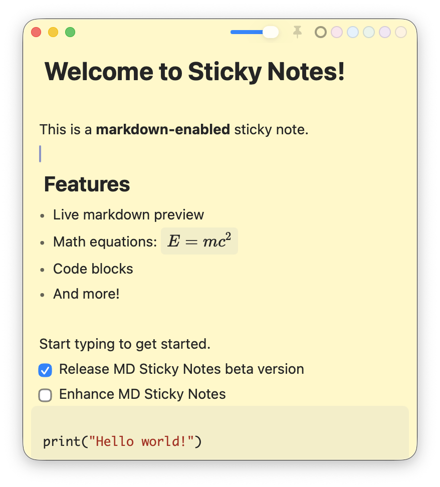

# MD Sticky Notes

MD Sticky Notes is a native macOS task and note app for people who need their work to stay visible. It combines floating Markdown notes with optional Google Tasks synchronization.

Instead of making every task live in one passive checklist, MD Sticky Notes turns tasks into floating Markdown windows that can stay on screen, carry due dates, use colors, and optionally sync with Google Tasks.




## Why It Exists

Normal task apps are easy to ignore when the task list is out of sight. MD Sticky Notes is built around visual persistence:

- tasks can stay as always-available floating notes
- markdown keeps notes flexible enough for checklists, context, links, and quick dumps
- due dates and Google Tasks sync keep the same utility as a conventional to-do app
- colors and separate windows make different kinds of work easier to scan at a glance

## What It Does

- Floating markdown sticky notes with live preview
- One shared `WKWebView` reparented across note windows to keep memory usage low
- Local SQLite persistence for note content, window state, sync state, and mutation outbox
- Optional Google Tasks sync through the repo-local `backend/` service
- Global modifier chords that work while another app is focused: release Control+Option to create a note and release Option+Command to show/hide notes
- Per-note due dates, custom colors, and manual `Sync Now`

## Privacy And Security

This public repo does not include live credentials. Real secrets should stay in local environment files, GitHub repository secrets, macOS Keychain, Google Secret Manager, or another secret store.

Ignored or intentionally absent from the public source:

- `backend/.env` and `backend/.env.local`
- OAuth client JSON files
- Apple signing certificates and provisioning files
- GitHub, Google, database, and app-session tokens
- local databases, build outputs, app bundles, and `node_modules`
- agent-only local instruction files

The backend stores Google refresh tokens encrypted at rest, and the macOS app stores backend session tokens in Keychain.

## Local Development

### Prerequisites

- macOS 12+
- Swift 5.9+
- Node.js 18+
- Local Postgres if you want to exercise the backend

### App-only build

```bash
./build-app.sh
open build/StickyNotes.app
```

### Full local sync loop with the mock backend

```bash
./scripts/dev-run-backend.sh
```

In another terminal:

```bash
./scripts/dev-build-app.sh
open build/StickyNotes.app
```

Inside the app:

1. Open `Settings`
2. Enable `Use Custom Backend URL (Development)`
3. Leave the custom URL as `http://127.0.0.1:8787`
4. Click `Sign In With Google`

In mock mode that sign-in completes locally and exposes fake task lists so you can test note creation, list selection, due dates, deletes, and `Sync Now`.

## Real Google Tasks Locally

The macOS app talks to the backend, and the backend owns the Google OAuth refresh token.

1. Create a Google OAuth web application client
2. Enable the Google Tasks API
3. Set the redirect URI to the backend callback URL
4. Fill out `backend/.env` from `backend/.env.example`

Then:

```bash
cd backend
npm install
npx prisma migrate deploy
npm run dev
```

In the app, enable the custom backend override, point it at `http://127.0.0.1:8787`, sign in, choose task lists, and use `Sync Now`.

More details are in [backend/README.md](backend/README.md).

## Production / Private Beta

This repo includes the repo-side pieces needed to run a hosted private beta:

- multi-user backend lookup keyed by Google subject instead of a single local user
- an authenticated optional cron endpoint at `POST /internal/cron/sync`
- a Railway service rooted at `backend/` with managed Postgres and `/healthz` readiness checks
- a backend Dockerfile and additive Prisma migrations
- build pipeline support for Developer ID signing, hardened runtime, notarization, stapling, ZIP, and DMG artifacts

Key production files:

- [build-app.sh](build-app.sh)
- [backend/Dockerfile](backend/Dockerfile)
- [backend/railway.json](backend/railway.json)
- [docs/architecture.md](docs/architecture.md)

The canonical production API is `https://backend-production-15d8.up.railway.app`. Localhost is supported only through the explicit development override in Settings. The files under `infra/gcp/` and the GCP scripts are optional reference material and are not invoked by CI.

## Release Builds

Local builds work with ad-hoc signing by default:

```bash
./build-app.sh
```

Signed and notarized release builds require Apple credentials:

```bash
export APPLE_DEVELOPER_IDENTITY="Developer ID Application: Your Name (TEAMID)"
export APPLE_NOTARY_PROFILE="your-notarytool-profile"
export ALLOW_ADHOC_SIGNING=0
./build-app.sh
```

Useful environment overrides:

- `APP_VERSION`
- `APP_BUILD`
- `PRODUCT_BUNDLE_IDENTIFIER`
- `APP_DISPLAY_NAME`
- `SKIP_DMG=1`
- `SKIP_ZIP=1`
- `CREATE_STYLED_DMG=1`

## Architecture

- `Sources/StickyNotes`: Swift/AppKit shell, native windows, persistence, sync client
- `editor-web/src/editor.js`: CodeMirror 6 editor and markdown rendering logic
- `backend/src`: Fastify + Prisma backend for OAuth, sync state, projection, polling, and SSE

The most important app-level architectural choice is that it uses one shared `WKWebView` across note windows. The active window owns the live editor and inactive windows show snapshots or previews.

The complete component, function, route, sync-flow, and hosting map is in [docs/architecture.md](docs/architecture.md).

## License

MIT
