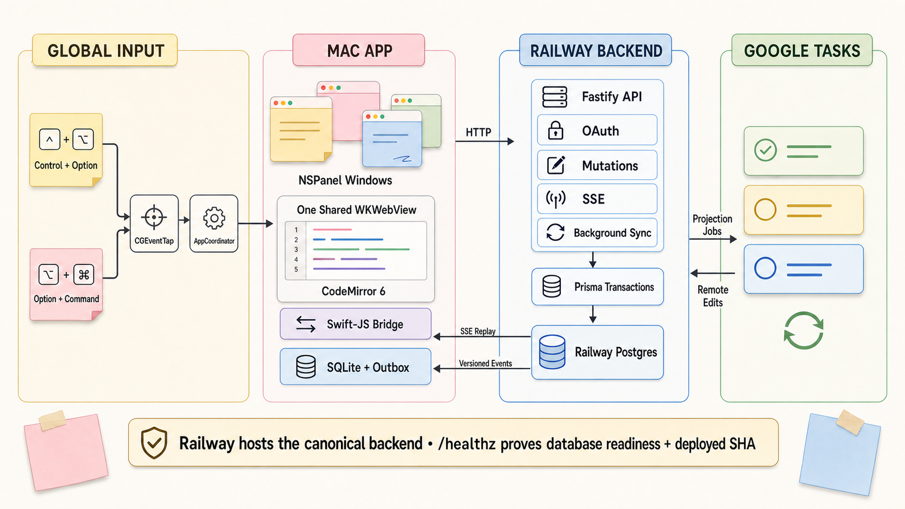
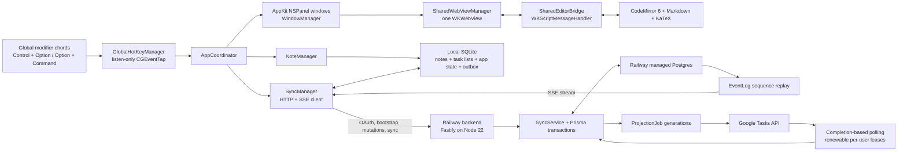

# MD Sticky Notes runtime architecture

This document is the source-of-truth map for the shipped macOS app and its canonical Railway backend. The GCP scripts are optional references; they are not part of the active deployment path.

## Runtime topology

## macOS ownership map

| Area | File / primary functions | Responsibility and connections |
|---|---|---|
| App lifecycle and menus | `StickyNotesApp.swift`: `applicationDidFinishLaunching`, `MenuBarCommands` | Starts services, wires callbacks, keeps menu commands available without Input Monitoring, and displays the new chord glyphs. |
| Global chords | `GlobalHotKeyManager.swift`: `start`, `handleEvent`, `normalizedModifiers`; `ModifierChordRecognizer.swift`: `handleFlagsChanged`, `handleNonModifierKeyDown` | A listen-only session `CGEventTap` normalizes left/right keys, arms only exact chords, cancels extra input, fires once on full release, and re-enables a disabled tap. Calls `AppCoordinator.createNewNote` or `toggleAllNotesVisibilityFromGlobalHotKey`. |
| Note/window orchestration | `AppCoordinator.swift`: `createNewNote`, `handleContentChange`, `closeNoteWindow`, `showAllNotes`, `hideAllNotes` | Joins note state, windows, editor state, and synchronization. |
| Native windows | `WindowManager.swift`; `NoteWindowController.swift` | Creates and positions `NSPanel` windows. The key window owns the shared web view; inactive windows show snapshots. |
| Shared editor | `SharedWebViewManager.swift`: `attachWebView`, `switchToNote`, `cacheSerializedState`; `SharedEditorBridge.swift` | Reparents one `WKWebView`, snapshots before moving it, serializes cursor/scroll/document state, and routes messages by note ID. |
| Markdown editor | `editor-web/src/editor.js`: `buildMarkdownDecos`, `buildMathDecorations`, `runVerticalBlockNavigation`; `vertical-navigation.js` | CodeMirror 6 syntax decorations, KaTeX rendering, search, tables, and logical math/table arrow traversal. Calls Swift through `window.webkit.messageHandlers.editorBridge`. |
| Local model | `NoteManager.swift`: `createNote`, `updateNoteContent`, `applyServerNote`, `applyServerDeletion`, `acknowledgeServerVersion` | Maintains active notes, rejects server-version rollback, and prohibits detaching synchronized notes from a task list. |
| Durable local data | `PersistenceManager.swift`: `runMigrations`, `migrateOutboxToFullNoteMutations`, `saveNote`, `saveQueuedMutation`, `deleteQueuedMutations` | SQLite schema v2. Stores notes, window/editor state, task-list cache, session metadata, and a coalesced outbox. Writes and migrations are transactional and surface failures. |
| Network synchronization | `SyncManager.swift`: `queueUpsertMutation`, `flushOutbox`, `applyBootstrap`, `startEventStream`, `handleEventData` | Sends full-note `upsert_note` / `delete_note` mutations with `baseServerVersion`, keeps acknowledged items until local persistence succeeds, defers remote state behind pending local mutations, and consumes ordered SSE events. |
| Credentials and preferences | `KeychainHelper.swift`; `SettingsView.swift` | Session tokens live in macOS Keychain. Settings shows backend selection, account status, task lists, persistence errors, and Input Monitoring state. |

## HTTP route and service map

| Route | Handler / service function | Input to output |
|---|---|---|
| `GET /healthz` | `app.ts` health handler | Runs `SELECT 1`; returns database readiness, sync provider, and `APP_RELEASE_SHA`. |
| `GET /auth/google/start` | `createOAuthState`, Google OAuth client | Validates the fixed desktop callback, stores a hash of an opaque state value with expiry, then redirects to Google. Mock mode issues a local app code. |
| `GET /auth/google/callback` | `claimOAuthState`, `getOrCreateUserByGoogleSubject` | Atomically consumes state once, exchanges the Google code, stores encrypted refresh credentials, and returns a short-lived desktop app code. |
| `POST /auth/app/exchange` | atomic `AppAuthCode.updateMany` + `AppSession.create` | Consumes the desktop code once and returns a bearer session plus bootstrap state. |
| `GET /v1/bootstrap` | `SyncService.bootstrap` | Returns current notes, task-list subscriptions, versioned tombstones, and latest event sequence. |
| `GET /v1/task-lists` | `listTaskListsForUser` | Lists Google/mock lists joined to persisted selected/default preferences. |
| `PATCH /v1/preferences/sync` | `updateTaskListPreferences` | Transactionally updates selected/default lists and emits `preferences.updated`. |
| `POST /v1/mutations` | `applyMutations` | Validates full-note upsert/delete envelopes. Each note write, idempotency row, projection generation, and event is one Prisma transaction. Returns `applied`, `duplicate`, or `conflict` plus the canonical note/tombstone. |
| `GET /v1/events/stream?since=` | database-backed SSE handler | Replays `EventLog` in pages of 500 from any nonnegative sequence, polls for cross-instance events, and sends heartbeats. The in-process hub is only a latency hint. |
| `POST /v1/sync/now` | `SyncService.syncNow` / `runSyncNow` | Acquires a renewable per-user lease, pulls genuine Google changes, processes current projection generations, then returns the latest sequence. |
| `POST /internal/cron/sync` | `requireInternalCronAuth`, `runScheduledSync` | Optional authenticated external trigger. Uses bounded user concurrency and the same leases as manual/background sync. |

## Synchronization rules

1. A local edit replaces any older queued field mutation with one complete note snapshot and its current `baseServerVersion`.
2. The backend rejects a stale base version with the canonical note or tombstone. Duplicate mutation IDs return the already-canonical state without another event.
3. A committed mutation increments the projection-job generation. A worker can clear only the generation it processed, so an older worker cannot erase newer work.
4. The last projected Google title/plaintext/list/due-date fingerprint distinguishes an echo from a genuine remote edit. Echoes update metadata only and preserve rich Markdown.
5. A genuine Google edit intentionally wins, rebuilds the note from Google plaintext, increments the server version, cancels stale projection work, and emits a new event.
6. The desktop applies a server event only when its sequence/version is newer and no pending local mutation supersedes it. A conflict response reconciles deferred state after upload.

## Hosting and release path

- Canonical API: `https://backend-production-15d8.up.railway.app`
- Compute: Railway `backend` service, built from `backend/Dockerfile` using `backend/railway.json`
- Database: Railway managed Postgres
- Startup: `prisma migrate deploy` followed by the Fastify server
- Readiness: Railway checks `/healthz`; the response identifies the exact Git SHA through `APP_RELEASE_SHA`
- Background work: the Fastify process runs a completion-based interval; the cron route is optional
- Desktop: Developer ID-signed `MD Sticky Notes 1.2.0` installed in `/Applications/StickyNotes.app`
- GitHub Actions: tests Swift, editor, backend/Postgres migrations, dependency audits, and secrets; it does not deploy
